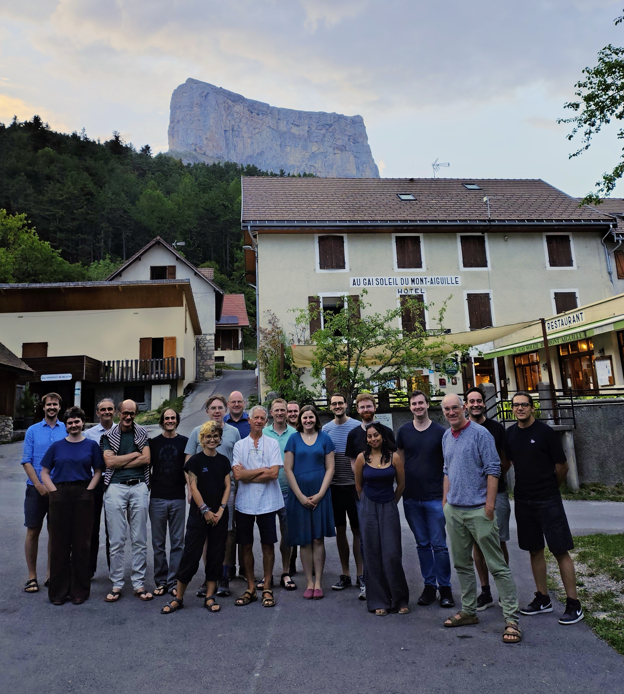

## Presentations

| Author          	| Title |
| --------------- 	| ----- |
| R. Claveau 		| Core flow recovery using PINNs |
| J. Aubert			| Time-correlated inverse geodynamo modelling |
| C. Finlay 		| Core field model covariance and resolution matrices |
| F. Gerick			| Steady states of the core, Magneto-Coriolis modes and core-mantle coupling |
| H. Rogers			| Regional core flow modelling to understand the south Atlantic anomaly |
| V. Lesur			| TBC |
| T. Lepage			| Response of a Fluid Core to Variations of an External Magnetic Field |
| D. Jault, P. Raggoo | boundary conditions (including DNS of the geodynamo equations in various set-up) |
| R. Claveau		| Update on benchmarking exercise |
| T. Sandnes		| Update on 1D model with neural networks |
| R. Dolati			| Modeling errors of representativeness with sparse symbolic regression |
| D. Cummins		| TBC |
| J. Velimsky		| Numerical simulation of the ocean-induced magnetic field |
| C. Finlay			| Extracting the Ocean-induced field from satellite data |
| C. Gruene			| EOF-based inverse modelling of the Ocean-induced magnetic field |